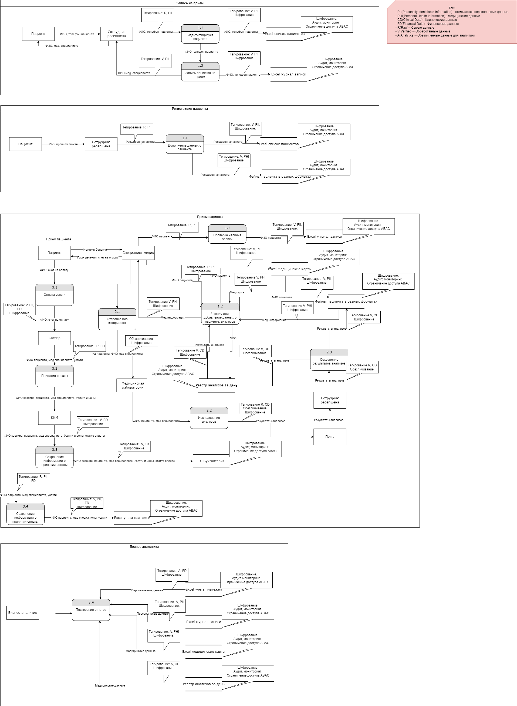
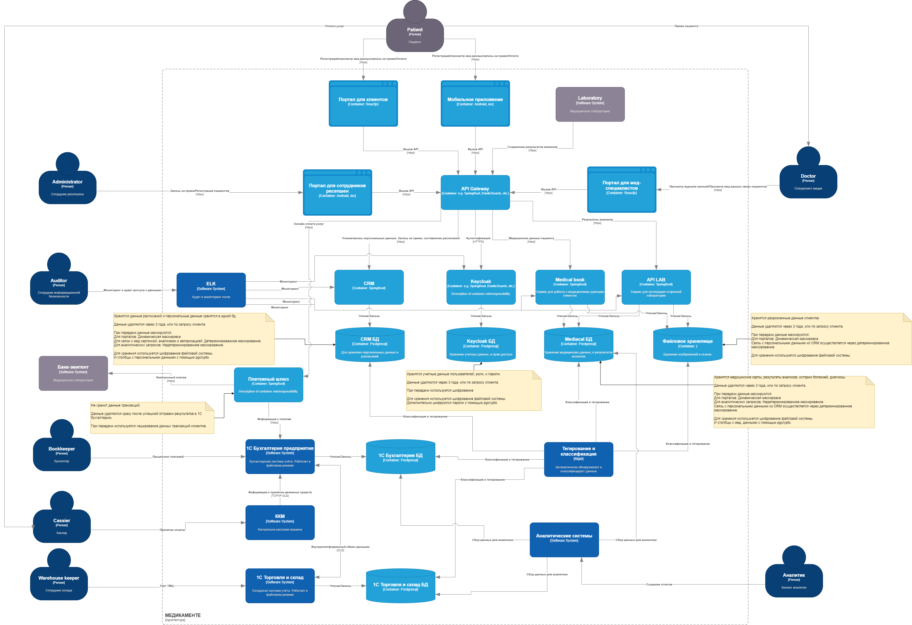

# architecture-medikamente

## Задание 1

### Диаграмма потоков данных

[Диаграмма потоков данных](Task1/dataFlowDiagrams.drawio)

[Список проблемных зон](Task1/problems.md)

[Улучшения](Task1/improvements.md)

## Задание 2

[Диаграмма контейнеров MVP](Task2/mvp.drawio)
